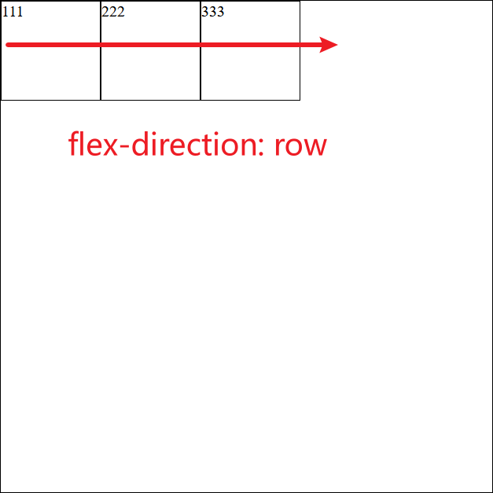
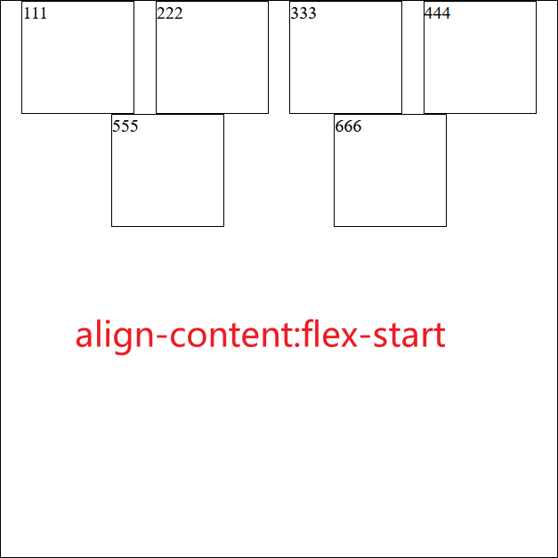

# Flex布局

Flex布局（Flexible Box布局模型）是一种先进且广泛使用的CSS布局技术，非常适合于响应式网页设计。

# 容器属性

## flex-direction

`flex-direction` 属性是 Flex 布局中非常核心的属性之一，它决定了 Flex **容器内**项目（Flex items）的排列方向。

`flex-direction` 设置的方向是 Flex 容器的主轴（main axis）。

- row（默认）：主轴方向与文本排列方向一致



- column：主轴方向垂直从上至下


- row-reverse：主轴方向与文本排列方向相反


- column-reverse：主轴方向为垂直从下至上


注：

- 如果改变了文档的 `writing-mode`（比如，从左到右变为从上到下书写），`flex-direction: row` 和 `row-reverse` 的行为也会相应改变。
- 使用 `column` 或 `column-reverse` 时，Flex 容器的高度可能需要明确设置，尤其是当你希望项目在垂直方向上展开时。
- 与主轴方向垂直的是交叉轴

## justify-content

`justify-content` 属性是 Flex 布局中调整 Flex 项目沿着主轴（main axis）的对齐方式的关键属性。了解并掌握 `justify-content` 的使用，对于创建灵活和响应式的布局非常重要。

- flex-start


- flex-end


- center：


- space-between:


- space-around: Flex 项目均匀分布在容器中，每个项目两侧的空间相等。注意这会导致项目之间的空间是项目与容器边缘空间的两倍


- space-evenly：Flex 项目均匀分布，包括与容器边缘的空间，每个项目周围的空间都相等。


注：

1. **主轴方向**:
   - `justify-content` 的效果取决于 `flex-direction` 设置的主轴方向。
   - 例如，如果 `flex-direction` 是 `column`，`justify-content` 将影响垂直对齐。
2. **与 `align-items` 和 `align-content` 的区别**:
   - `align-items` 调整 Flex 项目沿交叉轴的对齐方式。
   - `align-content` 用于多行 Flex 项目的交叉轴对齐，当你有多行 Flex 项目时才会有影响。
3. **应用场景**:
   - 在创建响应式布局时，可能会根据不同屏幕大小调整 `justify-content` 的值。
   - `space-between` 和 `space-around` 非常适合于均匀分布项目，例如导航栏链接或卡片。

## align-items

- stretch（默认）: Flex 项目会拉伸以填满容器的高度（如果主轴为水平）或宽度（如果主轴为垂直）。如果项目设置了明确的高度或宽度，这个属性则不会影响它。
- flex-start


- center


- flex-end


- baseline: Flex 项目的基线对齐。所有项目的文本基线将尝试对齐在同一条线上。对于文本内容，基线是其文本基线。对于其他类型的内容（如图片），浏览器有特定的规则来确定基线的位置。


## flex-wrap

`flex-wrap` 属性在 Flexbox 布局中用于控制 Flex 容器内项目（Flex items）的换行行为。

- nowrap（默认）: Flex 项目不会换行，即使它们溢出容器边界也会被压缩在一行内。


- wrap：Flex 项目将在必要时换行到下一行。


- wrap-reverse：Flex 项目也会在必要时换行，但是换行的方向与 `wrap` 相反。


## align-content

`align-content` 是 Flexbox 布局中的一个重要属性，它用于调整多行 Flex 项目在容器的交叉轴（cross axis）上的对齐方式。这个属性仅在有多行 Flex 项目时才起作用，也就是当项目超出一行并换行时，或者 `flex-wrap` 属性被设置为 `wrap` 或 `wrap-reverse`。

- **strech**（默认值）：Flex 行将拉伸以占据额外的空间，均匀分布在容器中。


- **flex-start**: 所有行紧靠容器的起始端排列。



- **flex-end**: 所有行紧靠容器的结束端排列。


- **center**: 所有行在容器中心对齐。


- **space-between**: 行之间均匀分布，第一行紧靠容器起始端，最后一行紧靠容器结束端。


- **space-around**: 行在容器中均匀分布，每行两侧的空间相等。


- **space-evenly**: 所有行均匀分布，包括与容器边缘的空间，每行周围的空间都相等。


# 项目属性

##  flex

`flex-grow` 和 `flex-shrink` 是 Flexbox 布局中非常重要的属性，它们控制着 Flex 容器内部项目（Flex items）的伸缩行为。理解这两个属性的工作方式对于创建灵活和响应式的布局至关重要。

### `flex-grow`

1. **定义**:
   - `flex-grow` 属性定义了 Flex 项目在必要时如何增长来填充额外的空间。
   - 它的值是一个无单位的数值（通常是一个正数），表示增长的比例。

2. **工作原理**:
   - 当 Flex 容器内有可用空间时，`flex-grow` 决定了项目相对于其他项目如何分配这些空间。
   - 例如，如果一个项目的 `flex-grow` 值是 2，另一个是 1，那么前者将获得的可用空间是后者的两倍。

3. **默认值**:
   - 默认情况下，Flex 项目的 `flex-grow` 值是 0，意味着它们不会增长超过内容所需的空间。

### `flex-shrink`

1. **定义**:
   - `flex-shrink` 属性定义了当 Flex 容器空间不足时，Flex 项目如何缩小。
   - 它的值也是一个无单位的数值（通常是一个正数），表示缩小的比例。

2. **工作原理**:
   - 当容器空间不足以容纳所有项目的基础大小时，`flex-shrink` 决定了各个项目相对于彼此如何收缩。
   - 一个较高的 `flex-shrink` 值意味着项目在空间不足时将更多地缩小。

3. **默认值**:
   - 默认情况下，Flex 项目的 `flex-shrink` 值是 1，表示当空间不足时，每个项目将等比例地缩小。

```html
<div class="flex-container">
  <div class="flex-item flex-item-1">1</div>
  <div class="flex-item flex-item-2">2</div>
</div>
```

```css
.flex-container {
  display: flex;
}

.flex-item-1 {
  flex-grow: 1; /* 在有额外空间时，这个项目会增长 */
  flex-shrink: 1; /* 在空间不足时，这个项目会缩小 */
}

.flex-item-2 {
  flex-grow: 2; /* 在有额外空间时，这个项目会比 flex-item-1 增长更多 */
  flex-shrink: 2; /* 在空间不足时，这个项目会比 flex-item-1 缩小更多 */
}
```

### `flex-basis`

- 定义 Flex 项目在分配额外空间之前的默认大小。
- 默认值为 `auto`，意味着项目的大小基于其内容大小。

### `flex` 属性的常用值

1. **flex: auto**:
   - 相当于 `flex: 1 1 auto`。
   - 项目会根据内容大小进行伸缩，并且在有可用空间时会增长。
2. **flex: none**:
   - 相当于 `flex: 0 0 auto`。
   - 项目不会增长或收缩，大小完全基于 `flex-basis` 或其内容大小。
3. **flex: 1** (或任何其他正数):
   - 相当于 `flex: 1 1 0`。
   - 项目会增长以填充额外空间，但不会小于其内容的大小。

## align-self

`align-self` 属性在 Flexbox 布局中用于单独控制 Flex 容器内某个项目（Flex item）在交叉轴（cross axis）上的对齐方式。这个属性允许你覆盖 Flex 容器的 `align-items` 属性对单个项目的影响。

### `align-self` 的值

1. **auto**:
   - 项目继承其父容器的 `align-items` 属性。如果没有设置 `align-items`，这相当于 `stretch`。
2. **flex-start**:
   - 项目位于容器的交叉轴起始端。
3. **flex-end**:
   - 项目位于容器的交叉轴结束端。
4. **center**:
   - 项目在交叉轴上居中。
5. **baseline**:
   - 项目的基线与容器中其他项目的基线对齐。
6. **stretch**:
   - 项目拉伸以填充容器在交叉轴方向的额外空间。

范例：

```html
<!DOCTYPE html>
<html lang="en">
<head>
    <meta charset="UTF-8">
    <meta name="viewport" content="width=device-width, initial-scale=1.0">
    <title>justify</title>

    <style>
        .flex-item{
            width: 100px;
            height: 100px;
            border: black solid 1px;
        }

        #box1{
            align-self: center;
        }

        #flex-container{
            width: 600px;
            height: 600px;
            border: black solid 1px;
            display: flex;
            flex-direction: row;
            justify-content: space-evenly;
            align-items: flex-start;
        }
    </style>
</head>
<body>
    <div id="flex-container">
        <div class="flex-item">111</div>
        <div class="flex-item" id="box1">222</div>
        <div class="flex-item">333</div>
        <div class="flex-item">444</div>
    </div>
</body>
</html>
```


### 使用细节

1. **覆盖容器对齐**:
   - `align-self` 允许单个项目有与 Flex 容器中的其他项目不同的对齐方式。
2. **特定项目调整**:
   - 这个属性特别有用于你需要调整容器中某个特定项目的对齐方式时。
3. **项目的高度或宽度**:
   - 当使用 `stretch` 值时，如果项目的高度（或宽度，取决于交叉轴方向）没有明确设置，它将填满容器的相应尺寸。
4. **与主轴方向无关**:
   - `align-self` 仅影响项目在交叉轴上的对齐，与主轴（main axis）方向无关。