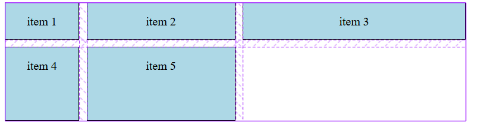
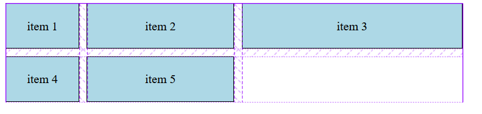
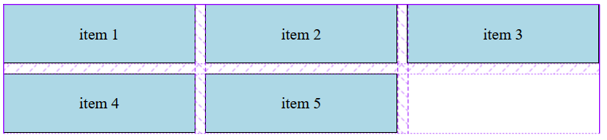
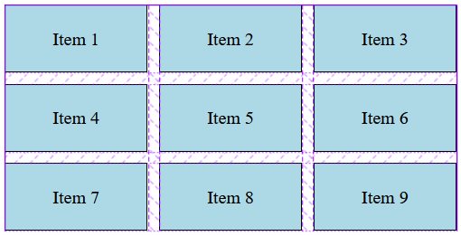
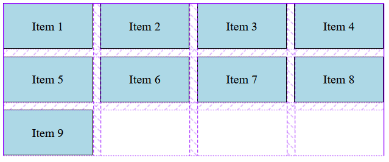
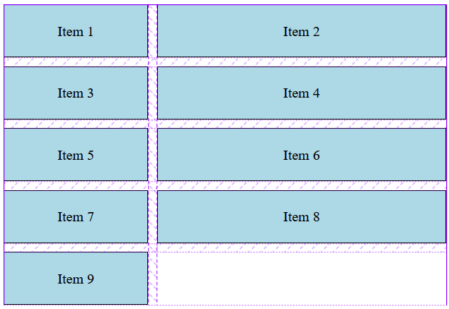
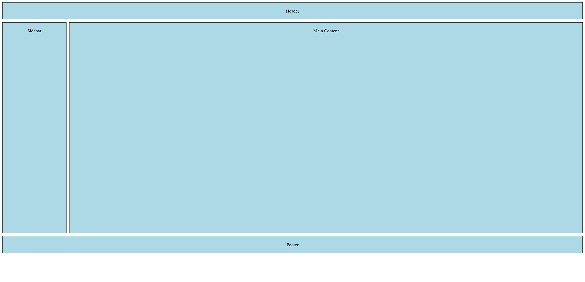
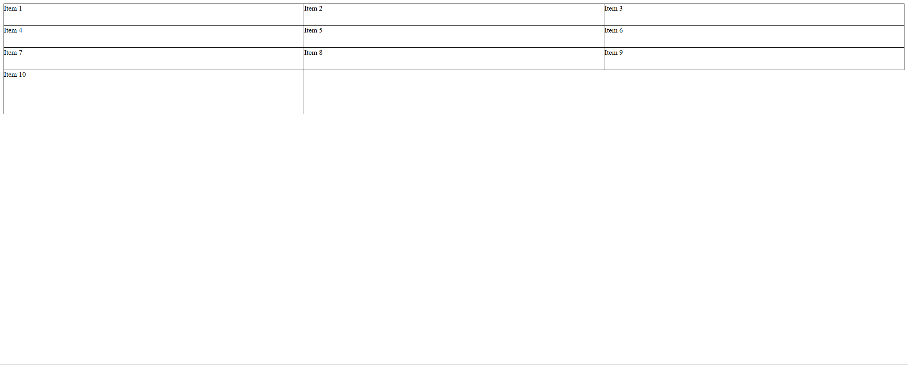
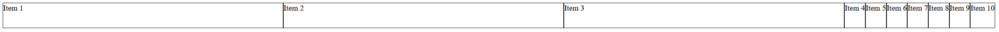

# CSS Grid布局

## Grid布局简介

## 基本术语

- 容器（Container）：网格容器是使用 CSS Grid 布局的最外层元素。通过在一个元素上设置 `display: grid` 或 `display: inline-grid`，可以将其变成一个网格容器。
- 项目（Item）： 网格项目是网格容器直接子元素。这些元素会自动成为容器的网格项，并按照定义的网格布局排列。
- 网格线（Grid Line）：网格线是构成网格结构的水平和垂直线。在 CSS Grid 中，网格线用于定义网格轨道的开始和结束。它们可以是数值（从 1 开始），也可以有名字。
- 网格轨道（Grid Track）：网格轨道是两个相邻网格线之间的空间。它可以是垂直的（列轨道）或水平的（行轨道）。轨道的大小可以通过 `grid-template-columns` 和 `grid-template-rows` 属性设置。
- 网格单元（Grid Cell）：网格单元是网格中的最小单位，它由两个相邻的行网格线和两个相邻的列网格线围成的空间。可以把它想象成表格中的一个单元格。
- 网格区域（Grid Area）： 网格区域是由四个网格线围成的一个较大的矩形空间，它可以包含一个或多个网格单元。通过 `grid-area` 属性可以指定一个网格项占据哪个网格区域。

# 设置Grid容器

- `display: grid` 和 `display: inline-grid`

# 定义网格

## `grid-template-columns` 和 `grid-template-rows`

基于长度定义的网格布局：

```css
.container{
    display: grid;
    grid-template-columns: 100px 200px 300px; /* 定义三列*/
    grid-template-rows: 50px 100px; /* 定义两行，行高分别为 50px 和 100px */
    gap: 10px;
}

.container > div {
    background-color: lightblue; /* 设置网格项的背景颜色 */
    text-align: center; /* 文本居中 */
    line-height: 50px; /* 行高，使文本垂直居中 */
    border: 1px solid black; /* 边框 */
}
```

```html
<div class="container">
  <div>Item 1</div>
  <div>Item 2</div>
  <div>Item 3</div>
  <div>Item 4</div>
  <div>Item 5</div>
</div>
```



基于比例的网格布局：

```css
.container{
    width: 600px;
    display: grid;
    grid-template-columns: 1fr 2fr 3fr; /* 定义三列，各列的宽度分别为 100px, 200px, 300px */
    gap: 10px;
}

.container > div {
    background-color: lightblue; /* 设置网格项的背景颜色 */
    text-align: center; /* 文本居中 */
    padding: 20px;
    border: 1px solid black; /* 边框 */
}
```

```html
<div class="container">
    <div class="item">item 1</div>
    <div class="item">item 2</div>
    <div class="item">item 3</div>
    <div class="item">item 4</div>
    <div class="item">item 5</div>
</div>
```



定义中重复相同大小的行或列的网格布局：

```css
.container{
    width: 600px;
    display: grid;
    grid-template-columns: repeat(3, 1fr);
    gap: 10px;
}

.container > div {
    background-color: lightblue; /* 设置网格项的背景颜色 */
    text-align: center; /* 文本居中 */
    padding: 20px;
    border: 1px solid black; /* 边框 */
}
```

这将创建三列，每列都占用可用空间的三分之一：



使用 `minmax()` 函数创建网格布局：

```css
.container {
    display: grid;
    width: 400px;
    grid-template-columns: repeat(3, minmax(100px, 1fr)); /* 创建三列，每列最小宽度为 100px，最大宽度为 1fr */
    gap: 10px; /* 设置网格项之间的间隙 */
}

.container > div {
    background-color: lightblue; /* 设置网格项的背景颜色 */
    text-align: center; /* 文本居中 */
    padding: 20px; /* 内边距 */
    border: 1px solid black; /* 边框 */
}
```

```html
<div class="container">
    <div>Item 1</div>
    <div>Item 2</div>
    <div>Item 3</div>
    <div>Item 4</div>
    <div>Item 5</div>
    <div>Item 6</div>
    <div>Item 7</div>
    <div>Item 8</div>
    <div>Item 9</div>
</div>
```



使用 `auto-fill` 或 `auto-fit` 可以创建灵活数灵活的网格布局：

```css
.container {
    display: grid;
    width: 500px;
    grid-template-columns: repeat(auto-fill, minmax(100px, 1fr));
    gap: 10px; /* 设置网格项之间的间隙 */
}

.container > div {
    background-color: lightblue; /* 设置网格项的背景颜色 */
    text-align: center; /* 文本居中 */
    padding: 20px; /* 内边距 */
    border: 1px solid black; /* 边框 */
}
```

```html
<div class="container">
    <div>Item 1</div>
    <div>Item 2</div>
    <div>Item 3</div>
    <div>Item 4</div>
    <div>Item 5</div>
    <div>Item 6</div>
    <div>Item 7</div>
    <div>Item 8</div>
    <div>Item 9</div>
</div>
```

这样会创建尽可能多的列，每列宽度至少 100px，且会根据可用空间自动调整。



给网格线命名，以便更容易地引用它们：

```css
.container {
    display: grid;
    width: 500px;
    grid-template-columns: [start] 1fr [middle] 2fr [end];
    gap: 10px; /* 设置网格项之间的间隙 */
}

.container > div {
    background-color: lightblue; /* 设置网格项的背景颜色 */
    text-align: center; /* 文本居中 */
    padding: 20px; /* 内边距 */
    border: 1px solid black; /* 边框 */
}
```

```html
<div class="container">
    <div>Item 1</div>
    <div>Item 2</div>
    <div>Item 3</div>
    <div>Item 4</div>
    <div>Item 5</div>
    <div>Item 6</div>
    <div>Item 7</div>
    <div>Item 8</div>
    <div>Item 9</div>
</div>
```

使用了命名网格线 `start`、`middle` 和 `end`。第一列占据 1 个分数单位的空间，而第二列占据 2 个分数单位的空间，意味着第二列的宽度是第一列的两倍。



## `grid-template-areas`

`grid-template-areas` 属性在 CSS Grid 布局中用于定义一个或多个命名网格区域。这种方法可以使布局的创建更直观且易于理解。

使用方法：

1. **定义区域**：在网格容器上使用 `grid-template-areas` 属性来定义每个区域的名称。使用引号来定义每一行，每个区域的名称占据一个单元格位置。未被命名的区域可以使用点 `.` 来表示。
2. **分配元素**：在网格项（网格容器的直接子元素）上使用 `grid-area` 属性来指定它们应该占据的网格区域。

```css
.container {
    display: grid;
    grid-template-columns: 1fr 8fr; /* 两列布局 */
    grid-template-rows: auto 1fr auto; /* 三行布局 */
    grid-template-areas: 
        "header header"
        "sidebar main"
        "footer footer";
    gap: 10px;
}

.header { grid-area: header; }
.sidebar { grid-area: sidebar; }
.main { 
    grid-area: main;
    height: 700px;
 }
.footer { grid-area: footer; }

    /* 一些基础样式 */
.header, .sidebar, .main, .footer {
    padding: 20px;
    background-color: lightblue;
    text-align: center;
    border: 1px solid black;
}
```

```html
<div class="container">
    <div class="header">Header</div>
    <div class="sidebar">Sidebar</div>
    <div class="main">Main Content</div>
    <div class="footer">Footer</div>
</div>
```



## `grid-auto-rows` 和 `grid-auto-columns`

在 CSS Grid 帜局中，`grid-auto-rows` 和 `grid-auto-columns` 属性用于为网格容器中隐式创建的行或列设置大小。所谓的隐式行或列是那些没有被 `grid-template-rows` 或 `grid-template-columns` 明确定义，但由于网格项的放置而必须存在的行或列。

案例：

```css
.container {
    display: grid;
    grid-template-columns: repeat(3, 1fr);
    grid-template-rows: repeat(3, 50px);
    grid-auto-rows: minmax(100px, auto); 
    /* 隐式行的高度至少为100px，但如果内容更多，高度可以增加 */
}

.item {
    border: 1px solid black;
}
```

```html
<div class="container">
    <div class="item">Item 1</div>
    <div class="item">Item 2</div>
    <div class="item">Item 3</div>
    <div class="item">Item 4</div>
    <div class="item">Item 5</div>
    <div class="item">Item 6</div>
    <div class="item">Item 7</div>
    <div class="item">Item 8</div>
    <div class="item">Item 9</div>
    <div class="item">Item 10</div> 
    <!-- 如果这是第四行的第一项，它将有100px高 -->
  </div>
```



当在网格布局中有多于通过 `grid-template-rows` 定义的行时，`grid-auto-rows` 属性会指定额外行的大小。例如，如果你定义了三行，但是有1个网格项被指定在第四行，那么第四行的大小就会由 `grid-auto-rows` 来决定。

## `grid-auto-flow`

`grid-auto-flow` 属性在 CSS Grid 布局中用于控制如何自动放置网格内的项目，即当你没有显式地放置它们时，它们应该如何流动到网格中。

属性值：

- **row**: 网格项目将按行顺序自动放置。这是默认值。
- **column**: 网格项目将按列顺序自动放置。
- **dense**: 该值会尝试填充网格的空白区域，即使这意味着项目可能会出现非顺序放置。

```css
.container {
    display: grid;
    grid-template-columns: repeat(3, 1fr);
    grid-auto-flow: column;
}

.item {
    border: 1px solid black;
}
```

```HTML
<div class="container">
    <div class="item">Item 1</div>
    <div class="item">Item 2</div>
    <div class="item">Item 3</div>
    <div class="item">Item 4</div>
    <div class="item">Item 5</div>
    <div class="item">Item 6</div>
    <div class="item">Item 7</div>
    <div class="item">Item 8</div>
    <div class="item">Item 9</div>
    <div class="item">Item 10</div> 
    <!-- 如果这是第四行的第一项，它将有100px高 -->
</div>
```



# 项目定位和尺寸调整

- `grid-column-start` / `end`

- `grid-row-start` / `end`
- `grid-area`
- 使用fr单位和auto布局

# 间距和对齐

- `grid-column-gap` / `grid-row-gap`
- `gap` 的新用法
- `justify-items`, `align-items`
- `justify-content`, `align-content`

# **嵌套网格**

- 如何创建嵌套网格
- 嵌套网格与父网格的关系

# 响应式布局

- 使用media查询
- 使用auto-fill和auto-fit
- 根据内容自动调整网格大小