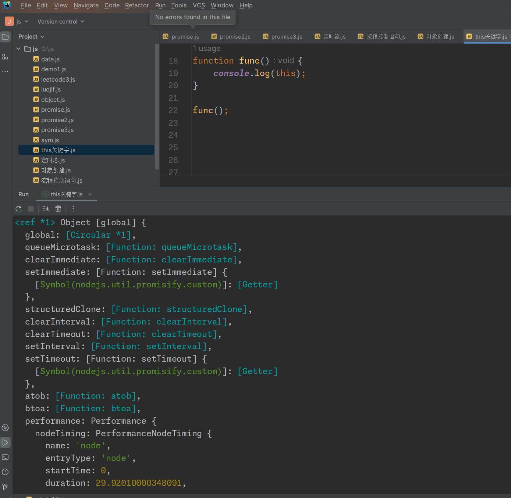

# 对象创建

## 对象字面量

```javascript
let person = {
    name: "alice",
    age: 23,
    greet: function (){
        console.log("hello");
    }
}
```

## 构造函数

```javascript
function Person(name, age){
    this.name = name;//在构造函数中，this指向新创建的对象
    this.age = age;
    this.greet = function (){
        console.log("hello");
    }
}

let person = new Person('zyf', 30);
```

##  `Object.create()`

```javascript
let proto = {
    greet:function (){
        console.log("hello!");
    }
};

let person1 = Object.create(proto);
person1.name = "zyf";
person1.age = 20;
```

## 类

```javascript
class Student {
    constructor(name, age) {
        this.name = name;
        this.age = age;
    }

    greet() {
        console.log("Hello!");
    }
}

let student = new Student("Dave", 40);
student.greet();
```

## 工厂方法

```javascript
function createPerson(name, age) {
  return {
    name: name,
    age: age,
    greet: function() {
      console.log("Hello!");
    }
  };
}

let person = createPerson("Eve", 35);
```

## 方式建议

- 对于简单或一次性的对象，使用 **对象字面量**。
- 当需要多个相似对象，并且涉及到封装时，可以使用 **构造函数** 或 **ES6类**。
- 如果你需要继承特定的原型或控制原型链，使用 **`Object.create()`**。
- **工厂函数**适用于不想使用`new`关键字或需要更复杂创建逻辑的场景。

# this关键字

在普通函数中，this关键字指向全局对象。在node.js环境下，函数`func`的`this`指向的是全局对象（在Node.js中称为`global`），这与在浏览器环境下`this`指向`window`对象有所不同。

```
function func(){
    console.log(this);
}

func();
```



在JavaScript中，`this`的指向可以变化，取决于函数的调用方式。

```javascript
let obj = {
    value: 5,
    getValue: function(){
        return this.value;
    }
}

console.log(obj.getValue());

//将方法赋值给一个变量
let getValue = obj.getValue;
//此时this不指向obj，而是指向全局对象或者严格模式下为undefined
console.log(getValue()); //输出undefined

//使用call改变this的指向
console.log(getValue.call(obj));//打印5
```

## JavaScript中的`this`

1. **上下文依赖**：在JavaScript中，`this`的值大多数情况下取决于函数的调用方式，而不是定义方式。它可以在运行时改变。

2. **全局上下文**：在全局执行上下文中（非严格模式），`this`指向全局对象（在浏览器中是`window`对象，在Node.js中是`global`对象）；在严格模式下，`this`将是`undefined`。

3. **函数上下文**：
   - 在普通函数调用中，`this`指向全局对象（非严格模式）或`undefined`（严格模式）。
   - 对于方法（对象内的函数），`this`指向调用该方法的对象。
   - 箭头函数没有自己的`this`，它继承自封闭执行上下文。

4. **构造函数**：在构造函数中，`this`指向新创建的对象。

5. **显式绑定**：可以通过`call`、`apply`或`bind`方法显式地设置`this`的值。

## Java中的`this`

1. **实例引用**：在Java中，`this`是对当前对象的引用，用于在实例方法或构造器中引用当前对象。

2. **不依赖调用方式**：`this`的值不取决于方法如何被调用，它总是指向当前对象。

3. **构造器中的使用**：在构造器中，`this`可以用来调用其他构造器，但必须作为构造器中的第一个语句。

4. **无全局上下文**：Java没有全局函数的概念，因此`this`总是指向当前对象。

5. **不可更改**：在Java中，`this`的指向是不可更改的。

## 总结

- 在JavaScript中，`this`的指向非常灵活，由函数的调用方式决定，可能会指向全局对象、当前对象、或根据`call`、`apply`、`bind`方法的使用而变化。
- 在Java中，`this`总是指向当前对象，它在实例方法和构造器中使用，指向固定且不依赖于调用方式。