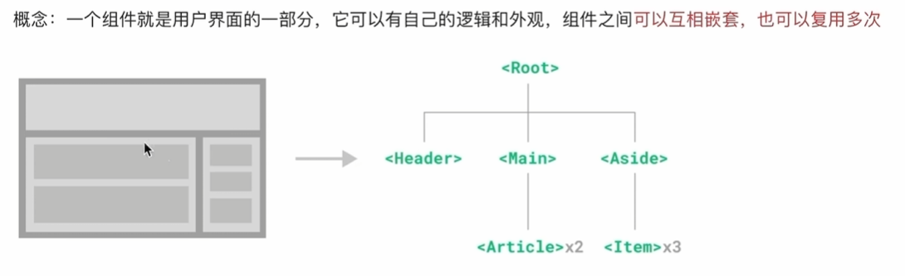
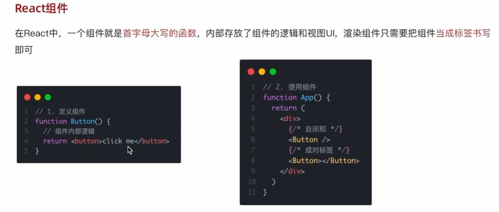

# 组件



一个组件就是首字母大写的函数，内部存放了组件的逻辑和视图UI，渲染组件只需要把组件当成**标签**书写即可。



# 范例

```javascript
const Button = () => {
    //业务逻辑组件逻辑
  return <button>click me!</button>;
};

function App() {
  return (
    <div className="App">
      <Button></Button>
      <Button />
    </div>
  );
}
```

